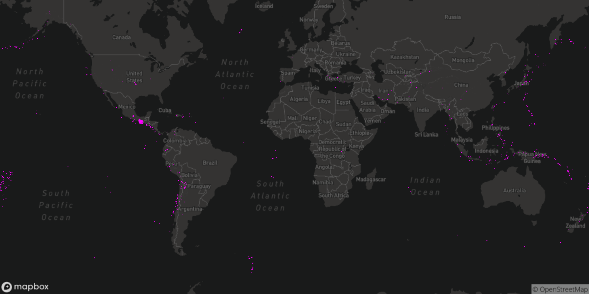

Plotting earthquake data with MapBox and p5.js. Based on [this tutorial](https://www.youtube.com/watch?v=ZiYdOwOrGyc&t=138s).

Uses [Web Mercator](https://en.wikipedia.org/wiki/Web_Mercator) formulas to project the points on the map. 

Earthquake data is available [here](https://earthquake.usgs.gov/earthquakes/feed/v1.0/csv.php).

# Usage

1. Copy `conf/Config.example.js` to `Config.js` and add your [MapBox API](https://www.mapbox.com/studio/account/tokens/) key to it.
2. Run `npm start` to start the web server.
3. Visit [http://localhost:3000](http://localhost:3000) in your browser.
4. After making changes, use `webpack` to bundle them.
